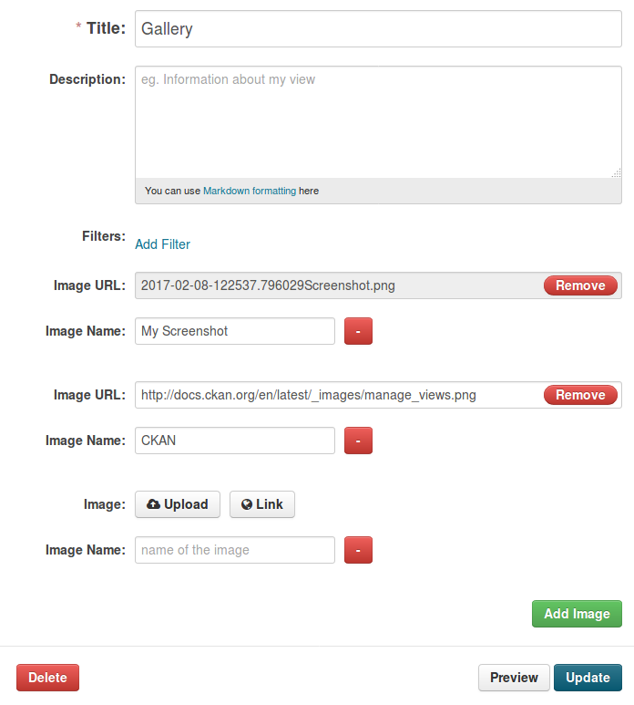

ckanext-galleryview
=============

This extension creates a resource view and lets you add a gallery to any
resource you have pictures for. Therefore you you can add pictures to a
resource without having them uploaded as resource.

In the gallery view you can either upload your pictures or state the URLs.

As seen in the edit view picture above, you can add as many pictures as you
want. You can give each picture a name which is then put underneath the picture
in the gallery view (picture one).

The name of the picture is a link to the original picture.
When the picture itself in the gallery is clicked, the following opens:

------------
Installation
------------

To install ckanext-galleryview:

1. Activate your CKAN virtual environment, for example::

     . /usr/lib/ckan/default/bin/activate

2. Install the ckanext-galleryview Python package into your virtual environment::

     pip install ckanext-galleryview

3. Add ``gallery_view`` to the ``ckan.plugins`` setting in your CKAN
   config file (by default the config file is located at
   ``/etc/ckan/default/production.ini``).

4. Restart CKAN. For example if you've deployed CKAN with Apache on Ubuntu::

     sudo service apache2 reload

------------------------
Development Installation
------------------------

To install ckanext-galleryview for development, activate your CKAN virtualenv and
do::

    git clone https://github.com/KatharinaSack/ckanext-galleryview.git
    cd ckanext-galleryview
    python setup.py develop
    pip install -r dev-requirements.txt

-----------------
Running the Tests
-----------------

To run the tests, do::

    nosetests --nologcapture --with-pylons=test.ini

To run the tests and produce a coverage report, first make sure you have
coverage installed in your virtualenv (``pip install coverage``) then run::

    nosetests --nologcapture --with-pylons=test.ini --with-coverage --cover-package=ckanext.galleryview --cover-inclusive --cover-erase --cover-tests

---------------------------------
Registering ckanext-galleryview on PyPI
---------------------------------

ckanext-galleryview should be availabe on PyPI as
https://pypi.python.org/pypi/ckanext-galleryview. If that link doesn't work, then
you can register the project on PyPI for the first time by following these
steps:

1. Create a source distribution of the project::

     python setup.py sdist

2. Register the project::

     python setup.py register

3. Upload the source distribution to PyPI::

     python setup.py sdist upload

4. Tag the first release of the project on GitHub with the version number from
   the ``setup.py`` file. For example if the version number in ``setup.py`` is
   0.0.1 then do::

       git tag 0.0.1
       git push --tags

----------------------------------------
Releasing a New Version of ckanext-galleryview
----------------------------------------

ckanext-galleryview is availabe on PyPI as https://pypi.python.org/pypi/ckanext-galleryview.
To publish a new version to PyPI follow these steps:

1. Update the version number in the ``setup.py`` file.
   See `PEP 440 <http://legacy.python.org/dev/peps/pep-0440/#public-version-identifiers>`_
   for how to choose version numbers.

2. Create a source distribution of the new version::

     python setup.py sdist

3. Upload the source distribution to PyPI::

     python setup.py sdist upload

4. Tag the new release of the project on GitHub with the version number from
   the ``setup.py`` file. For example if the version number in ``setup.py`` is
   0.0.2 then do::

       git tag 0.0.2
       git push --tags
